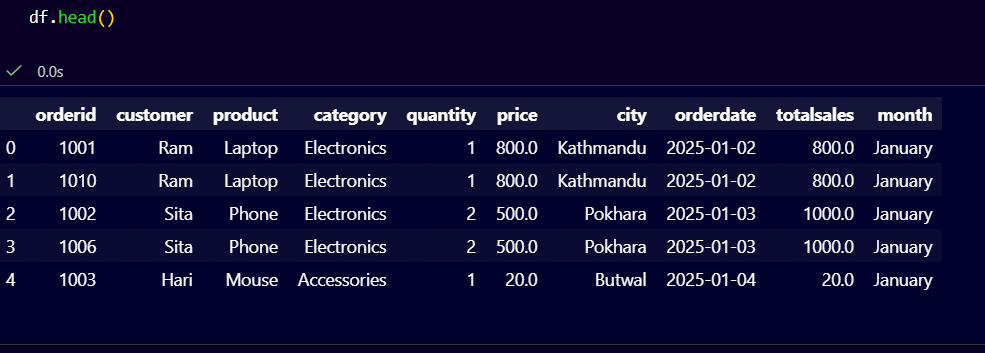
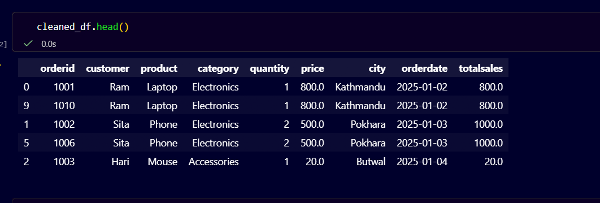
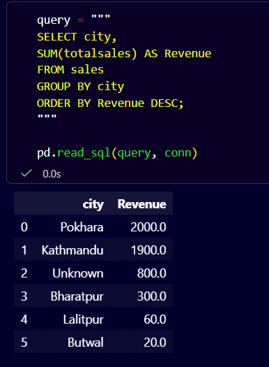
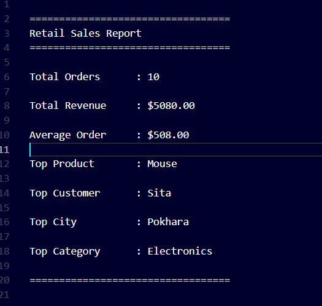

# 🛒 Retail Sales ETL Pipeline

## 📌 Overview

This project demonstrates an end-to-end **ETL (Extract, Transform, Load)** pipeline using **Python, Pandas, SQLite, and SQL**.

The pipeline extracts raw retail sales data from a CSV file, cleans and transforms it, loads it into a SQLite database, performs business analysis using SQL queries, and generates a summary report.

---

## 🛠️ Tech Stack

- Python
- Pandas
- SQLite
- SQL
- Jupyter Notebook

---

## 📂 Project Structure

```text
Retail-Sales-ETL/
│
├── data/
│   ├── raw/
│   └── processed/
│
├── database/
│
├── reports/
│
├── screenshots/
│
├── sql/
│
├── main.ipynb
├── README.md
├── requirements.txt
└── .gitignore
```

---

## 🔄 ETL Workflow

```text
Raw CSV
   │
   ▼
Extract
   │
   ▼
Clean & Transform
   │
   ▼
Business Analysis
   │
   ▼
SQLite Database
   │
   ▼
SQL Queries
   │
   ▼
Report Generation
```

---

## ✨ Features

- Extract data from CSV
- Clean missing values
- Remove duplicate records
- Transform and enrich data
- Calculate Total Sales
- Load data into SQLite
- Perform SQL analysis
- Generate business reports

---

## 📊 Business Analysis

- Total Revenue
- Total Orders
- Average Order Value
- Revenue by City
- Revenue by Category
- Top Selling Product
- Top Customer
- Monthly Revenue

---

## 📸 Project Preview

### 📄 Raw Dataset



---

### 🧹 Cleaned Dataset



---

### 🗄️ SQL Query Output



---

### 📈 Final Report



---

## 🚀 Future Improvements

- PostgreSQL Integration
- Apache Airflow
- Docker
- Streamlit Dashboard
- Power BI Dashboard

---

## 👩‍💻 Author

**Pratima Sapkota**

Computer Engineering Student | Aspiring Data Engineer